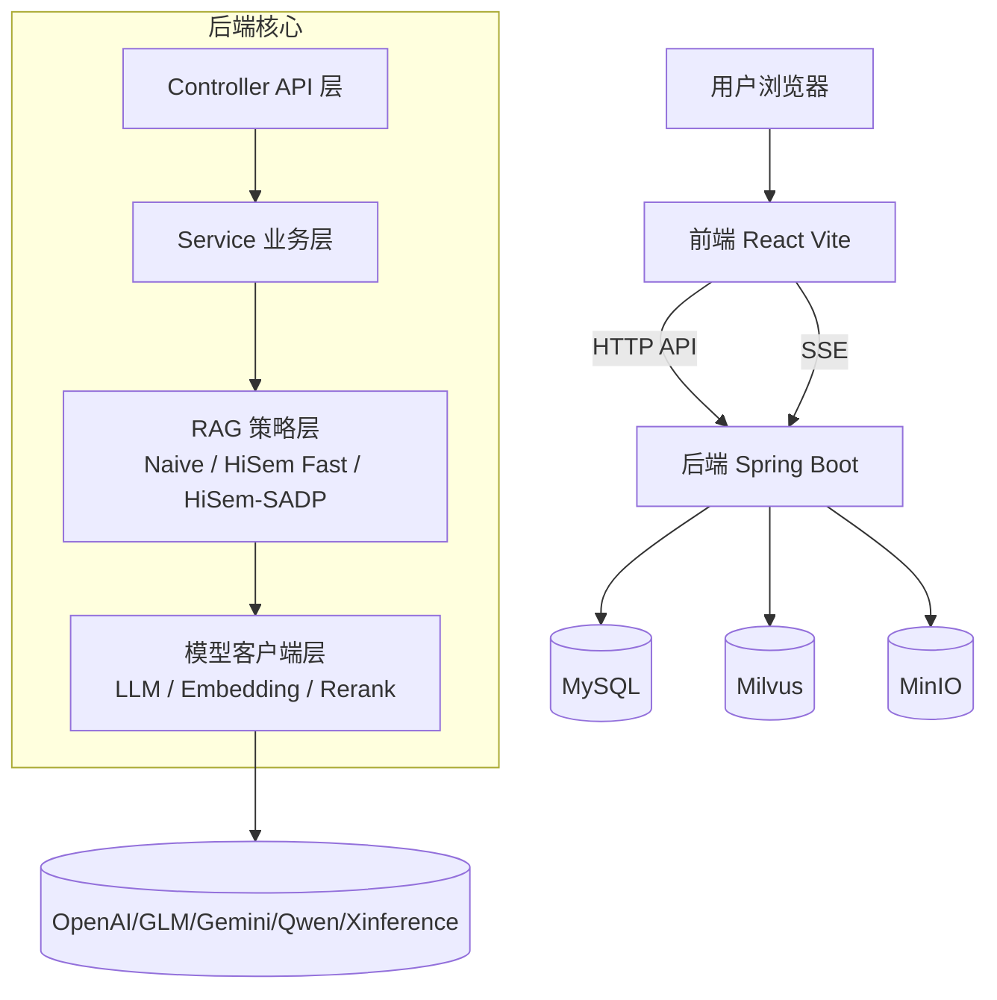
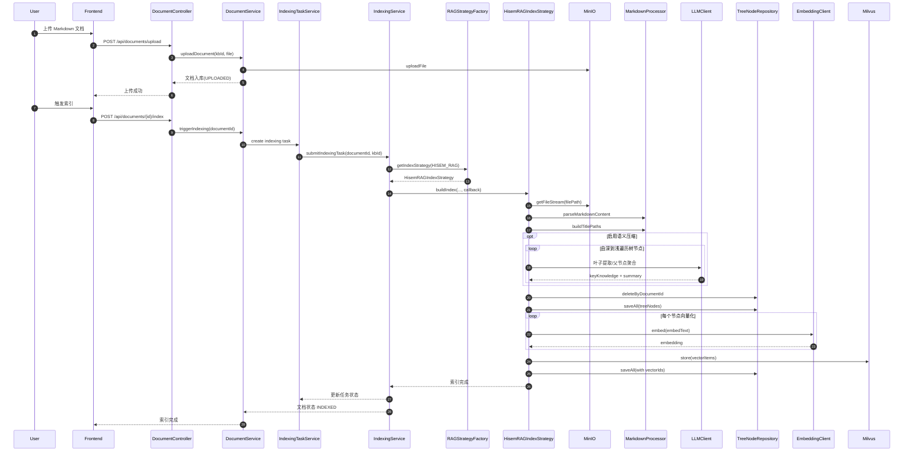
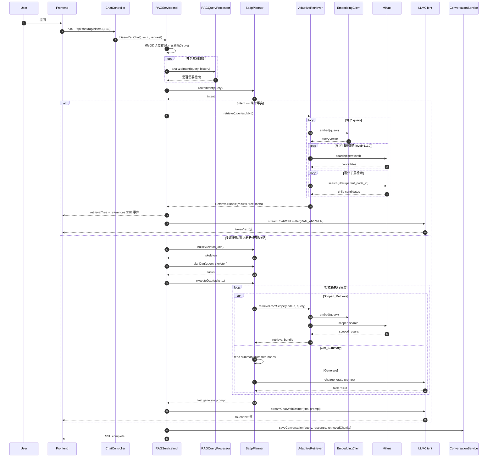

# SmartDoc 3.0

<div align="center">

[]()
[]()
[]()
[]()
[]()
[]()

基于 RAG、HiSem 与 SADP 的智能文档问答系统。

</div>

## 项目简介

SmartDoc 提供从文档上传、索引构建、检索问答到会话追踪的完整闭环能力：

- 前端：React + TypeScript + Vite + Ant Design
- 后端：Spring Boot + LangChain4j
- 存储：MySQL + Milvus + MinIO
- 检索策略：Naive RAG、HiSem Fast、HiSem-SADP（完整层级语义 + 规划执行）
- 交互：SSE 流式输出、参考文献展示、检索树可视化、Token 用量事件

## 系统架构图



## 检索策略与接口映射

| 逻辑能力 | 索引策略类型 | 对话接口 | 说明 |
|---|---|---|---|
| Naive RAG | NAIVE_RAG | POST /api/chat/rag/naive | 平铺 chunk 检索 |
| HiSem Fast | HISEM_RAG_FAST | POST /api/chat/rag/hisem-fast | Markdown 分层切块 + 标题增强 |
| HiSem-SADP 完整版 | HISEM_RAG | POST /api/chat/rag/hisem | 同一接口内根据意图路由：简单事实走自适应层级检索，复杂问题走 SADP DAG |

说明：当前代码里没有单独的 /api/chat/rag/hisem-sadp 路由；HiSem-SADP 能力由 /api/chat/rag/hisem 在复杂意图分支触发。

## 快速开始

### 1) Docker Compose

```bash
git clone https://github.com/CharmingDaiDai/SmartRAG.git
cd smartDoc

cp .env.example .env
# 按需填写 .env（数据库、JWT、模型 Key 等）

docker compose up -d --build
docker compose ps
```

默认访问地址：

- 前端：http://localhost:3000
- 后端：http://localhost:8080
- Swagger：http://localhost:8080/swagger-ui.html
- MinIO Console：http://localhost:9001
- Attu：http://localhost:8000

### 2) 本地开发

后端（默认激活 dev 配置，端口 18080）：

```bash
mvn spring-boot:run
```

前端（开发端口 3000，Vite 代理 /api 到 http://localhost:18080）：

```bash
cd frontend
npm install
npm run dev
```

## API 概览（按当前 Controller 实现）

### 认证

- POST /api/auth/register
- POST /api/auth/login
- POST /api/auth/login/github
- GET /api/auth/callback/github
- POST /api/auth/exchange-token
- POST /api/auth/refresh-token

### 知识库

- POST /api/knowledge-bases
- GET /api/knowledge-bases
- GET /api/knowledge-bases/{kbId}
- DELETE /api/knowledge-bases/{kbId}

### 文档

- POST /api/documents/upload
- POST /api/documents/batch-upload
- GET /api/documents
- GET /api/documents/{kbId}
- GET /api/documents/detail/{documentId}
- GET /api/documents/{documentId}/preview/meta
- GET /api/documents/{documentId}/preview/text
- GET /api/documents/{documentId}/preview/raw
- DELETE /api/documents/{documentId}
- DELETE /api/documents/batch
- GET /api/documents/index-progress
- POST /api/documents/{documentId}/index
- POST /api/documents/batch-index
- POST /api/documents/{documentId}/rebuild-index
- POST /api/documents/batch-rebuild-index

### Chunk / TreeNode 管理

- GET /api/chunks
- PUT /api/chunks/{id}
- GET /api/tree-nodes/tree
- PUT /api/tree-nodes/{id}

### 对话与模型

- POST /api/chat/rag/naive (SSE)
- POST /api/chat/rag/hisem-fast (SSE)
- POST /api/chat/rag/hisem (SSE)
- GET /api/models/llms
- GET /api/models/embeddings
- GET /api/models/reranks

### 会话、用户、仪表盘

- GET /api/conversations/sessions
- GET /api/conversations/sessions/{sessionId}
- DELETE /api/conversations/sessions/{sessionId}
- GET /api/profile
- PUT /api/profile
- POST /api/profile/avatar
- PUT /api/profile/password
- GET /api/dashboard/statistics

## HiSem-SADP 索引构建完整时序图



## HiSem-SADP 检索完整时序图



## 项目结构

```text
smartDoc/
├── src/main/java/com/mtmn/smartdoc/
│   ├── controller/
│   ├── service/
│   ├── rag/
│   │   ├── impl/
│   │   ├── retriever/
│   │   └── sadp/
│   └── model/
├── src/main/resources/
├── frontend/
│   ├── src/
│   ├── package.json
│   └── vite.config.ts
├── docker-compose.yml
├── Dockerfile.backend
├── README-docker.md
└── pom.xml
```

## 说明

- Docker 详细部署、备份与运维建议见 README-docker.md。
- HiSem-SADP 对话入口为 /api/chat/rag/hisem；当问题被路由为复杂意图时，自动执行 SADP DAG 规划与检索。
- 注意：HiSem-SADP（完整版）链路要求知识库文档为 Markdown（.md）格式。

## 许可证

本项目采用 MIT License。
